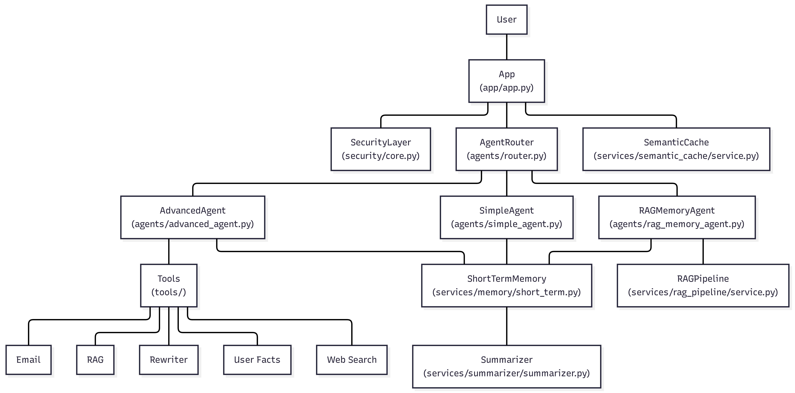
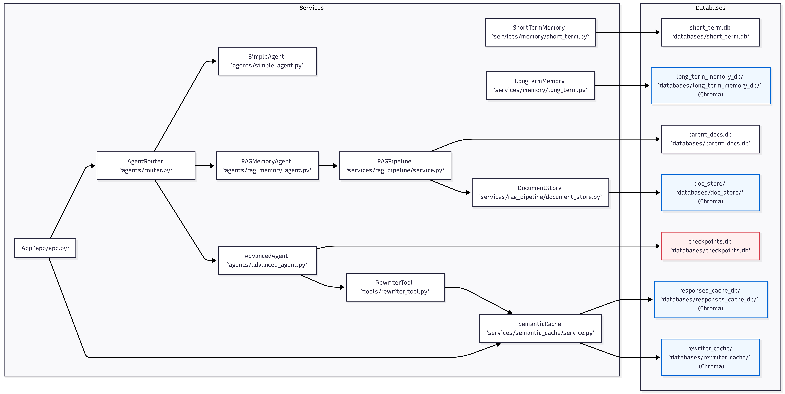
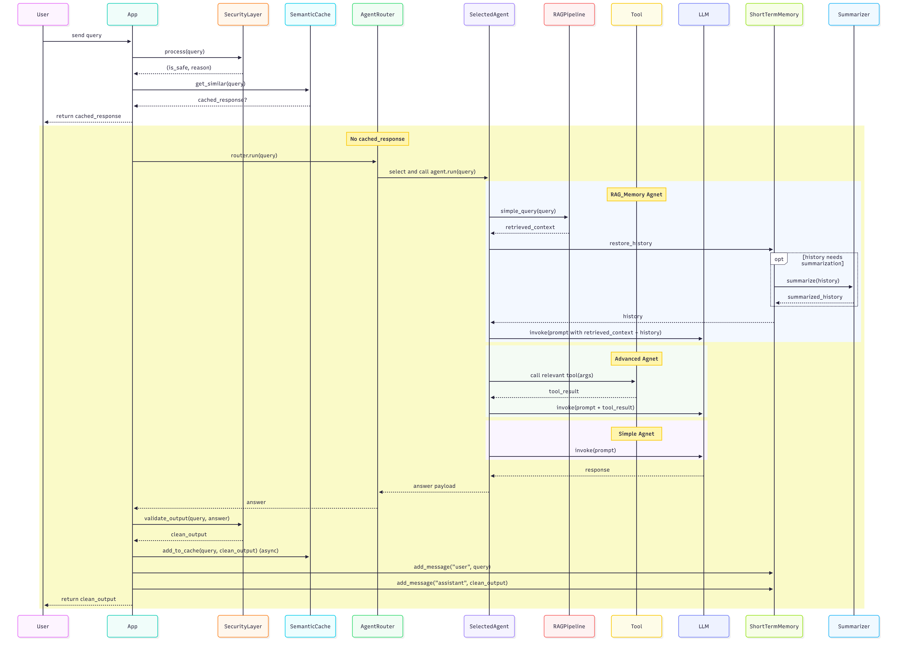

# AI-Playground

> A modular Python project for building and experimenting with agentic AI workflows. It covers multi-agent routing, RAG, short- and long-term memory, semantic caching, tool use, and query rewriting — each implemented as an independent, composable service.

---

## Features

- **Multi-agent routing** — an `AgentRouter` dynamically selects the right agent (Simple, Advanced, or RAGMemory) based on the incoming query
- **RAG pipeline** — retrieval-augmented generation with a parent-document store backed by Chroma, supporting two retrieval strategies: parent_child (default) and summary
- **Short-term memory** — per-session conversation history with automatic summarization when it grows too long
- **Long-term memory** — persistent user facts stored in a Chroma vector database
- **Semantic caching** — semantically similar queries are served from cache, bypassing the LLM; rewritten query variants are also cached
- **Security layer** — queries are screened by SecurityLayer before reaching any agent, and responses are validated before being returned to the user
- **Tool use** — the AdvancedAgent has access to Email, RAG, Rewriter, User Facts, and Web Search tools
- **Query rewriting** — a dedicated rewriter service that reformulates queries for better retrieval

---

## Architecture

### 1. System Architecture Overview

This diagram shows the full component hierarchy of the project — how every class and file relates to every other one, from the entry point down to the databases.

`App (app/app.py)` sits at the top and wires together three top-level services: the `SecurityLayer` (safety checks), the `AgentRouter` (agent selection), and the `SemanticCache` (response caching). The router dispatches to one of three agents depending on the query:

- **SimpleAgent** — direct LLM call with short-term memory
- **AdvancedAgent** — LLM call with tool access (Email, RAG, Rewriter, User Facts, Web Search)
- **RAGMemoryAgent** — retrieval-augmented generation with full memory and summarization



---

### 2. Services & Data Storage Map

This diagram zooms into the data layer — which services own which databases and how they connect.

The system uses a mix of SQLite (for short-term session history, parent_docs and checkpoints), a JSON file for tracking ingested documents, and Chroma vector stores (for long-term memory, the document store, responses cache, and rewriter cache). Each service is responsible for its own storage.

| Service | Database | Type |
|---|---|---|
| ShortTermMemory | `databases/short_term.db` | SQLite |
| LongTermMemory | `databases/long_term_memory_db/` | Chroma |
| RAGPipeline | `databases/doc_store/` | Chroma |
| RAGPipeline | `databases/parent_docs.db` | SQLite |
| RAGPipeline | `databases/ingested_files.json` | JSON |
| AdvancedAgent | `databases/checkpoints.db` | SQLite |
| SemanticCache | `databases/responses_cache_db/` | Chroma |
| SemanticCache | `databases/rewriter_cache/` | Chroma |



---

### 3. Request Lifecycle (Sequence Diagram)

This diagram traces exactly what happens from the moment a user sends a query to the moment a response comes back. It is the most detailed view of the system and is best read after you understand the architecture above.

End-to-End Request Lifecycle:
 

**Step 1 — User sends a query**
 
The user inputs a query via the interactive CLI. `App._run(user_query)` is invoked.
 
---
 
**Step 2 — Parallel security check + cache lookup**
 
`App` immediately fires two checks in parallel:
 
- **`SecurityLayer.process(user_query)`** runs two sub-checks:
  - `TokenManager.check_request(user_input)` — validates token limits and request allowance; returns `{"allowed": bool, "reason": str}`
  - `InputGuard.analyze(user_input)` — detects jailbreak attempts and prompt injection; returns `{"safe": bool, "reason": str}`
  - The token and input checks run concurrently. If either fails, `process()` returns `(False, reason, report)` immediately — the request goes no further.
  - On success, returns `(True, "Input approved for processing.", report)`
- **`SemanticCache.get_similar(user_query)`** — searches the Chroma vector store for a semantically similar past query; returns `{"response": str | None}`
Both futures are resolved before proceeding.
 
---
 
**Step 3 — Early exits**
 
- If `is_safe` is `False` → `App` returns `"Security check failed: {reason}"` to the user. Nothing else runs.
- If `cached_response["response"]` is not `None` → the cached response is returned directly to the user. The router, agents, and LLM are bypassed entirely.
---
 
**Step 4 — Agent routing**
 
If no cache hit and the query is safe, `App` calls `AgentRouter.run(user_query)`. The router selects and invokes one of three agents:
 
- **RAGMemoryAgent**:
  1. Calls `RAGPipeline.simple_query(query)` → returns `retrieved_context`
  2. Calls `ShortTermMemory.restore_history()` → returns conversation `history`
     - If history exceeds the context threshold, `Summarizer.summarize(history)` is called first → returns `summarized_history`, which is used in place of the full history
  3. Calls `LLM.invoke(prompt with retrieved_context + history)` → returns `response`
- **AdvancedAgent**:
  1. The LLM determines which tool(s) to call and invokes them with the required arguments → returns `tool_result`
  2. `tool_result` is fed back to the LLM for the next step
  3. Steps 1–2 repeat until the LLM determines no further tool calls are needed → returns final `response`
- **SimpleAgent**:
  1. Calls `LLM.invoke(prompt)` directly → returns `response`
The router packages the result and returns `{"answer": str}` to `App`.
 
---
 
**Step 5 — Output validation**
 
`App` extracts `out = result.get("answer")` and calls `SecurityLayer.validate_output(out, user_query)`, which runs two checks in parallel:
 
- `ContentGuard.analyze(llm_response, original_input)` — checks the response for unsafe or policy-violating content; returns `{"safe": bool}`
- `OutputGuard.sanitize(llm_response)` — sanitizes the raw LLM output; returns `{"safe": bool, "sanitized_text": str}`
Both must pass. Returns `(final_safe, clean_output, report)`.
 
---
 
**Step 6 — Cache write + memory update**
 
After validation, `App` does three things:
 
1. **Semantic cache write** *(async, non-blocking)* — `SemanticCache.add_to_cache(user_query, clean_output)` is fired in a daemon thread so it does not delay the response.
2. **Memory update** — `ShortTermMemory.add_message("user", user_query)` and `add_message("assistant", clean_output)` are called to persist the exchange for future turns.




---

## Project Structure
 
```
AI-Playground/
│
├── main.py                          # Entry point — CLI interface for selecting agent type,
│                                    # model, loading documents, and managing sessions
│
├── app/
│   ├── builder.py                   # AppBuilder — fluent builder for wiring together all
│   │                                # services and producing a configured App instance
│   └── app.py                       # App — orchestrates the full request lifecycle:
│                                    # security checks, cache lookups, agent routing,
│                                    # output validation, and memory/cache writes
│
├── agents/
│   ├── router.py                    # AgentRouter — selects and invokes the right agent
│   ├── simple_agent.py              # SimpleAgent — direct LLM call, no retrieval or tools
│   ├── advanced_agent.py            # AdvancedAgent — LLM + tool use (Email, RAG, Rewriter,
│   │                                # UserFacts, WebSearch); manages tool-call checkpoints
│   └── rag_memory_agent.py          # RAGMemoryAgent — RAG retrieval + short-term memory
│                                    # + optional summarization before LLM invocation
│
├── services/
│   ├── memory/
│   │   ├── short_term.py            # ShortTermMemory — stores and retrieves per-session
│   │   │                            # conversation history in SQLite
│   │   └── long_term.py             # LongTermMemory — stores and queries persistent user
│   │                                # facts using a Chroma vector database
│   │
│   ├── rag_pipeline/
│   │   ├── service.py               # RAGPipeline — handles document ingestion and retrieval;
│   │   │                            # supports parent_child (default) and summary strategies
│   │   └── document_store.py        # DocumentStore — manages the parent document SQLite store
│   │                                # and tracks ingested files via a JSON registry
│   │
│   ├── semantic_cache/
│   │   └── service.py               # SemanticCache — stores query-response pairs in Chroma;
│   │                                # serves cached responses for semantically similar queries,
│   │                                # including rewritten query variants
│   │
│   ├── loader/
│   │   ├── service.py               # Loader — public interface for document loading;
│   │   │                            # keeps track of ingested files via ingested_files.json
│   │   │                            # and provides two loading strategies:
│   │   │                            # • markdown conversion (default) — converts documents
│   │   │                            #   to markdown before embedding
│   │   │                            # • LangChain loaders — uses LangChain's document
│   │   │                            #   loaders to load documents directly
│   │   └── loader.py                # Internal implementation of the loading strategies
│   │
│   ├── summarizer/
│   │   └── summarizer.py            # Summarizer — provides two methods:
│   │                                # • summarize_conversation() — condenses conversation
│   │                                #   history when it exceeds the context threshold
│   │                                # • summarize_document() — generates a summary of each
│   │                                #   document when using the summary RAG strategy
│   │
│   └── query_rewriter/
│       └── service.py               # QueryRewriter — reformulates the query according to
│                                    # the selected strategy
│
├── tools/
│   ├── email_tool.py                # Email — sends emails on behalf of the user
│   │
│   ├── rag_tool.py                  # RAG — exposes the DocumentStore as a retrieval tool;
│   │                                # the tool description dynamically pulls ingested
│   │                                # document names from ingested_files.json so the agent
│   │                                # knows exactly what this tool is useful for
│   │
│   ├── rewriter_tool.py             # Rewriter — exposes the QueryRewriter as a tool;
│   │                                # when invoked, the original and rewritten queries are
│   │                                # stored in the rewriter cache in a non-blocking thread
│   │
│   ├── user_facts_tool.py           # UserFacts (x2) — two separate tools: one for storing
│   │                                # long-term user facts (written to LongTermMemory), and one for retrieving them
│   │
│   ├── web_search_tool.py           # WebSearch — performs live web searches
│   │
│   └── tools.py                     # Registers and exports all tools for use by AdvancedAgent
│
├── security/
│   └── core.py                      # SecurityLayer — screens incoming queries for safety
│                                    # and validates outgoing responses before delivery
│
├── data/
│   ├── documents/                   # Documents to be ingested into the RAG pipeline are placed here
│   └── ingested_files.json          # JSON — registry of already-ingested document files
│
├── databases/                       # All persistent storage (auto-created)
│   ├── short_term.db                # SQLite — session conversation history
│   ├── long_term_memory_db/         # Chroma — persistent user facts
│   ├── doc_store/                   # Chroma — embedded document chunks
│   ├── parent_docs.db               # SQLite — full parent documents for parent_child RAG
│   ├── responses_cache_db/          # Chroma — semantic response cache
│   ├── rewriter_cache/              # Chroma — semantic cache of rewritten query
│   └── checkpoints.db               # SQLite — AdvancedAgent tool-call checkpoints
│
└── requirements.txt
```

---

## Getting Started

```bash
git clone https://github.com/rashadibrahim/AI-Playground.git
cd AI-Playground
pip install -r requirements.txt
```

Create a `.env` file in the project root with the following keys:

```env
GROQ_API_KEY=

TAVILY_API_KEY=

MAIL_ACCOUNT=
MAIL_PASSWORD=
SMTP_SERVER=smtp.gmail.com
SMTP_PORT=587
```

```bash
python main.py
```

---
